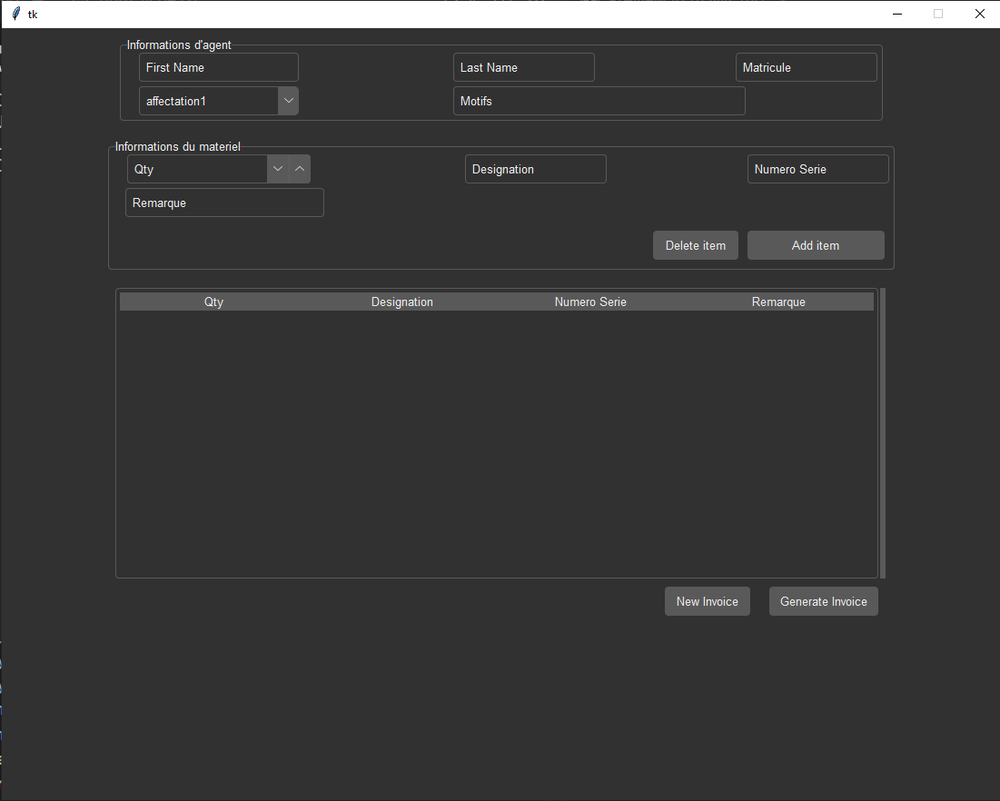
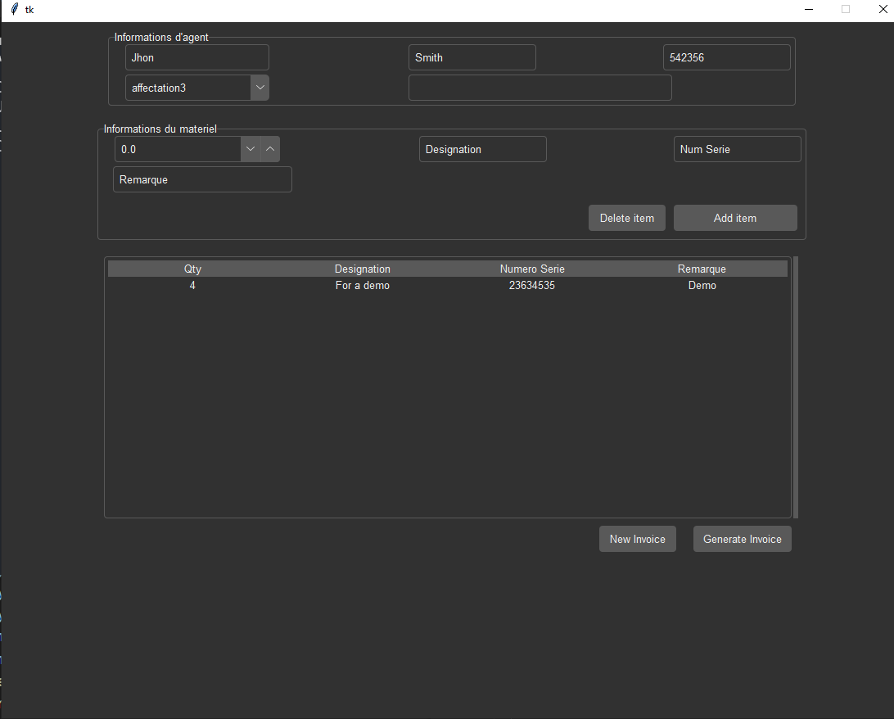

# Document Generator
Document generator is a Python Desktop application for creating an example of the document you want to generate with Microsoft word that can hold all different elements such as pictures, footer, header... Then you can still edit the document through the application.

## Installation
Use the package manager pip to install the requirements bellow:
- Tkinter [Read About it](https://docs.python.org/3/library/tkinter.html)
- docxtpl [For More Info](https://pypi.org/project/docxtpl/)
```bash
pip install tk
pip install docxtpl
```

### Usage of en external library for the theme
for its beauty and simplicity the theme used in the project is a library called forest created by [rdbende](https://github.com/rdbende/)<br>
You can clone the repo using the command below:
```
git clone https://github.com/rdbende/Forest-ttk-theme.git
``` 
# Usage
* The main screen:<br>

* The input that will be casted in the template:

* The result (generated template)

